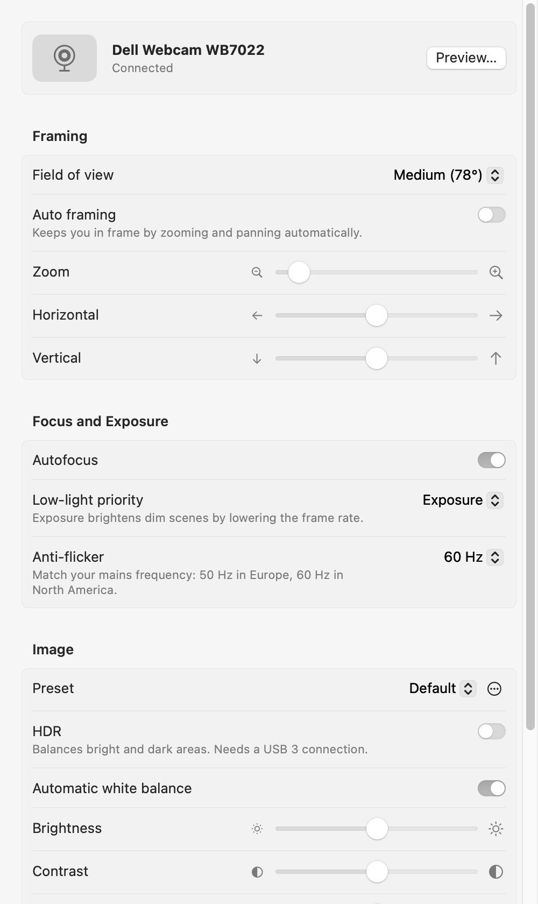

# Dell camera

A small System Settings pane for the **Dell Webcam WB7022**, so you can drop Dell Display and
Peripheral Manager (DDPM). It controls everything DDPM's webcam screens do — field of view,
auto framing, HDR, zoom, focus, white balance and image presets — with native macOS controls.



## Install

1. Download the latest `Dell-camera-<version>.dmg` from
   [Releases](https://github.com/Martodox/mac-dell-webcam-controller/releases/latest).
2. Open it and double-click **Dell camera.prefPane**.
3. Open it from the bottom of the System Settings sidebar.

Requires macOS 14 or later. Builds are signed with a Developer ID and notarized by Apple.

## Using it

- Every change is sent to the camera immediately and saved.
- **Preview…** opens a live preview window. The first time, macOS asks for camera access for
  *Dell Camera Agent* — allow it. (System Settings itself is never allowed to use the camera,
  so the preview runs in that small helper app instead.)
- **Keep settings applied**: the WB7022 forgets its settings whenever it reconnects or the Mac
  sleeps. Turn this on to have Dell Camera Agent run in the background and re-apply them at
  login, when the camera is plugged in, and after wake.
- **Preset** applies a look (HDR, white balance, brightness, contrast, saturation, sharpness).
  Default, Smooth, Vibrant and Warm match DDPM; use the ⋯ menu to save or delete your own.
  Presets don't change field of view, framing, zoom or focus.

Pan and tilt are digital, so they only move the image once you've zoomed in.

## Uninstall

1. Turn off **Keep settings applied**.
2. Quit System Settings and remove the pane and its data:

   ```sh
   rm -rf ~/Library/PreferencePanes/"Dell camera.prefPane" \
          ~/Library/Application\ Support/DellCameraConfigurator
   ```

## How it works

The pane talks to the camera with standard USB Video Class control requests through IOKit,
without opening the device exclusively, so the camera keeps working in other apps.

- **Standard UVC controls** (camera terminal and processing unit): zoom, pan/tilt, focus and
  autofocus, exposure priority, brightness, contrast, saturation, sharpness, white balance and
  anti-flicker.
- **Dell vendor commands**: field of view, HDR and the auto framing options are 8-byte
  commands written to extension unit 6, selector 1. The encoding comes from DDPM's own
  settings tables, e.g. FOV 90° is `0x005A0110FF`, sent little-endian.

Settings are stored in `~/Library/Application Support/DellCameraConfigurator/state.json`, which
both the pane and the agent read.

## Project layout

| Path | What |
| --- | --- |
| `CameraKit/` | Swift package: UVC device access, control table, settings, presets, tests |
| `CameraKit/Sources/DellCameraAgent/` | Background agent: re-applies settings, shows the preview |
| `Dell Camera Configurator/` | The preference pane (SwiftUI, hosted by `NSPreferencePane`) |
| `scripts/release.sh` | Local build, Developer ID signing, notarization and DMG |
| `.github/workflows/release.yml` | Publishes the committed DMG as a GitHub release |

## Building

Open `Dell Camera Configurator.xcodeproj` in Xcode and build the *Dell Camera Configurator*
scheme. A build phase compiles Dell Camera Agent from `CameraKit` and embeds it in the pane.
To try a build, quit System Settings and copy the product to `~/Library/PreferencePanes`.

Run the package tests with:

```sh
swift test --package-path CameraKit
```

## Releasing

Signing and notarization happen locally; GitHub never sees the certificate.

One-time setup: a *Developer ID Application* certificate in your keychain, and notarization
credentials stored with

```sh
xcrun notarytool store-credentials dell-camera-notary --apple-id <apple-id> --team-id <team-id>
```

Then, on a clean `master`:

```sh
scripts/release.sh 1.0.1
git push
```

The script builds a universal Release, signs it, notarizes and staples the DMG, and commits it
to `dist/` with its version, checksum and release notes. When that commit reaches GitHub, the
release workflow publishes it as `v1.0.1`. A changed DMG without a version bump fails the
workflow.

## Disclaimer

Not affiliated with or endorsed by Dell. The vendor commands were worked out from DDPM; use at
your own risk.
